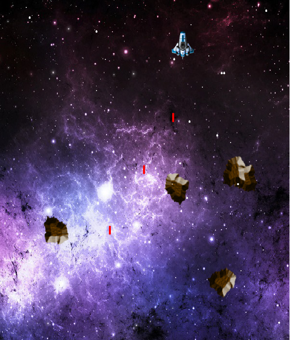

# FP7-webpage SpaceXplore

##Authors
Lokesh Manchi (@lokeshmanchi)

Rob Russell(@robdoesweb)

##Overview
We're designing a 2D space shooting game that uses graphics and sound to make it fun and interesting. The user will be able to control a spaceship and the purpose of the game is to avoid the obstacles that are ahead.

##Screenshot




##Concepts Demonstrated
Identify the OPL concepts demonstrated in your project. Be brief. A simple list and example is sufficient. 
* **Data abstraction** is used to provide access to the elements of the RSS feed.
* The objects in the OpenGL world are represented with **recursive data structures.**
* **Symbolic language processing techniques** are used in the parser.

##External Technology and Libraries
Briefly describe the existing technology you utilized, and how you used it. Provide a link to that technology(ies).
####Libraries used:

1. 2htdp/universe - [Racket-Universe](https://docs.racket-lang.org/teachpack/2htdpuniverse.html)
2. 2htdp/image - [Racket-Images](https://docs.racket-lang.org/teachpack/2htdpimage.html)
3. rsound - [Racket-Rsound] (https://docs.racket-lang.org/rsound/index.html)
4. lang/posn

##Favorite Scheme Expressions
####Lokesh Manchi (a team member)
Each team member should identify a favorite expression or procedure, written by them, and explain what it does. Why is it your favorite? What OPL philosophy does it embody?
Remember code looks something like this:
```scheme
(define (handle-key-down world key)
  (cond
    [(key=? key "left") (player 'move-left)]
    [(key=? key "right") (player 'move-right)]
    [(key=? key "up") (player 'move-up)]
    [(key=? key "down") (player 'move-down)]
    [(key=? key " ") (player 'shoot)]
    [else world]
    )
)
```
####Rob Russell (another team member)
This expression reads in a regular expression and elegantly matches it against a pre-existing hashmap....
```scheme
(let* ((expr (convert-to-regexp (read-line my-in-port)))
             (matches (flatten
                       (hash-map *words*
                                 (lambda (key value)
                                   (if (regexp-match expr key) key '()))))))
  matches)
```

##Additional Remarks
Anything else you want to say in your report. Can rename or remove this section.

#How to Download and Run
You may want to link to your latest release for easy downloading by people (such as Mark).

1. Click on release at the top of the page and download the most recent release
2. After downloading the file extract it and place it anywhere
3. Install rsound library on your computer throught the Dr.Racket package manager
4. In the project release click on SpaceXplore.rkt, which is the file that starts the game
5. A starter page will open up and you have to click on the right arrow key to initialize the game (first image in the screenshot section of this file)
6. A second window will pop up (second image in the screenshot section) and this is the game. The controls are the arrow keys to move around and the space bar to shoot
7. Dont get hit!

